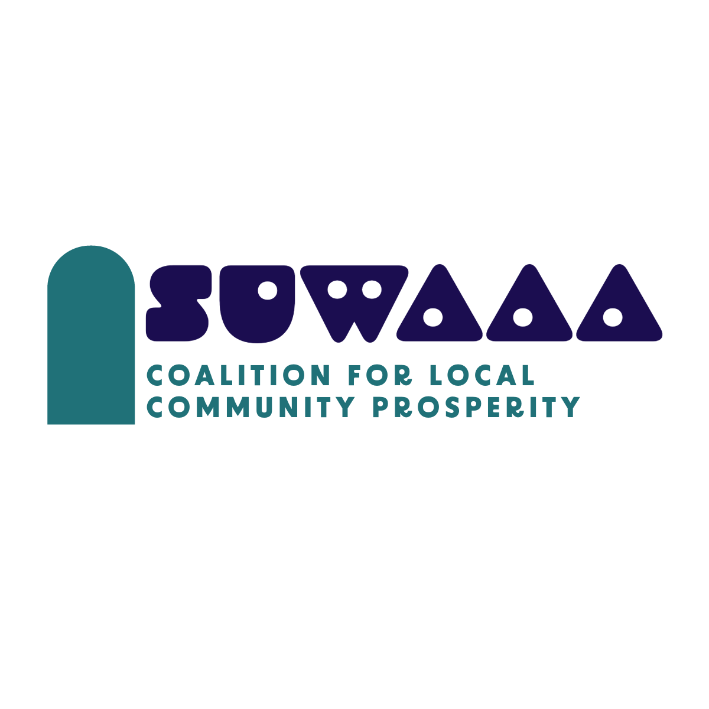

# イノベーションプロジェクト「Suwaaa」

## 概要
公立諏訪東京理科大学の学生が利用することのできる地域のお店一覧アプリを最終目標として開発を行う。

## 開発ルール
開発を行う際は下記のブランチルールに従う

また、常に最新のdevelopeブランチの状態になるようmerge処理を行う
### ブランチ
- main: 現在デプロイされているプロダクト
- develope: 開発中バージョンの中心
- feature: 新機能開発を行う際のブランチ(developeから派生させる)
- hotfix: 緊急のバグ修正を行う際のブランチ(developeから派生させる)

開発を行う際は`develope`ブランチから`feature/hotfix`ブランチを作成して開発するものとする。

また、ブランチを作成する場合は下記の命名規則に従うものとする。

`feature/[GitHub名]/[開発概要][IssueID]`

`hotfix/[GitHub名]/[開発概要][IssueID]`

例: `feature/Sora-210/create_new_page#0`

### Issueについて
作業する内容についてIssueを作成して作業するものとする。

作成する際は下記命名規則に従う
- プレフィックスにfeature/hotfixのいずれか正しいものをつける

### PRについて
各開発が終了した際はdevelopeブランチへPRを出すものとする。

また、PRを出した場合は各個人が自己レビューを行う。

PR申請者以外がレビューを行い問題ないと判断された場合はMerge処理を行う

### デブロイについて
Mainブランチが外部に公開する最新プロダクトとして更新された際にデブロイ作業を行うものとする.
